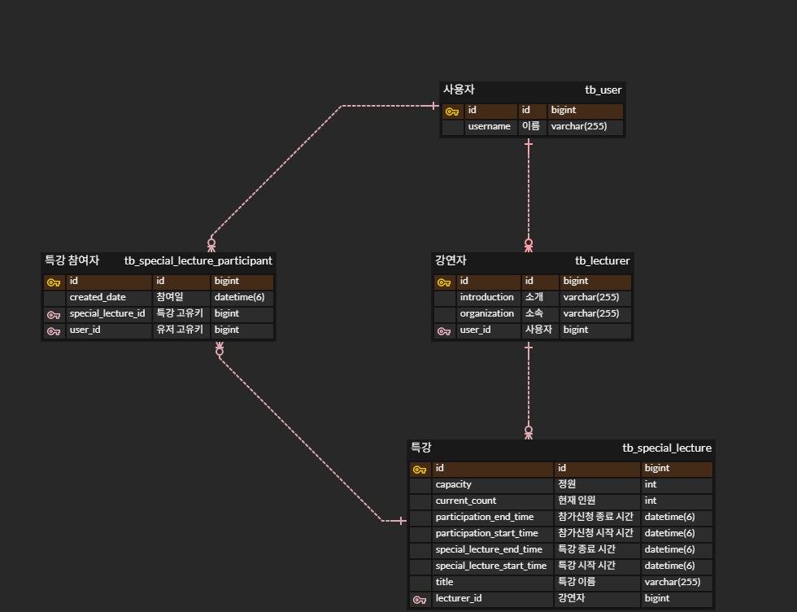

# 특강 신청 서비스
## API Specs

**1️⃣특강 신청 API**

- 특정 userId 로 선착순으로 제공되는 특강을 신청하는 API 를 작성합니다.
- 동일한 신청자는 동일한 강의에 대해서 한 번의 수강 신청만 성공할 수 있습니다.
- 특강은 선착순 30명만 신청 가능합니다.
- 이미 신청자가 30명이 초과 되면 이후 신청자는 요청을 실패합니다.

**2️⃣특강 신청 가능 목록 API**

- 날짜별로 현재 신청 가능한 특강 목록을 조회하는 API 를 작성합니다.
- 특강의 정원은 30명으로 고정이며, 사용자는 각 특강에 신청하기 전 목록을 조회해 볼 수 있어야 합니다.

**3️⃣특강 신청 완료 목록 조회 API**

- 특정 userId 로 신청 완료된 특강 목록을 조회하는 API 를 작성합니다.
- 각 항목은 특강 ID 및 이름, 강연자 정보를 담고 있어야 합니다.

## ERD

## 테이블 설계 의도

#### **유저(`tb_user`)와 강연자(`tb_lecturer`)**

- 강연자는 사용자 중 하나로, `tb_user`와 `tb_lecturer` 간 1:1 관계로 설계되었습니다. 
- 강연자 또한 플랫폼의 일반 사용자라고 생각했기 때문에, 사용자의 확장 개념으로 강연자를 정의했습니다.
- 이를 통해 사용자 정보와 강연자 정보를 분리하면서도 통합적으로 관리할 수 있습니다.

#### **특강(`tb_special_lecture`)**

- `tb_special_lecture` 테이블은 특강 관련 정보를 관리합니다.
- 요구사항에 따라 각 특강이 강연자(`tb_lecturer`) 정보를 포함하도록 설계되었습니다. 이를 통해 특강 목록 조회 시 강연자 정보를 함께 제공할 수 있습니다.
- 특강에는 정원(`capacity`), 현재 신청 인원(`current_count`), 신청 가능 시간(`participation_start_time`, `participation_end_time`)과 같은 필드를 포함하여, 특강 신청 API에서 선착순 및 신청 가능 여부를 처리할 수 있습니다.

#### **특강 참여자(`tb_special_lecture_participant`)**

- `tb_special_lecture_participant` 테이블은 사용자가 특정 특강에 참여한 정보를 관리합니다.
- 한 사용자가 여러 특강에 참여할 수 있고, 한 특강도 여러 사용자가 들을 수 있으므로 N:N 관계를 별도의 테이블로 분리했습니다.
- `user_id`와 `special_lecture_id`에 대해 복합 유니크 제약 조건을 적용하여, 동일 사용자가 동일 특강에 중복 신청할 수 없도록 데이터 정합성을 보장했습니다.
- `created_date` 필드는 사용자의 신청 시간을 저장하며, 신청 완료 목록 조회 정보에 사용됩니다.
